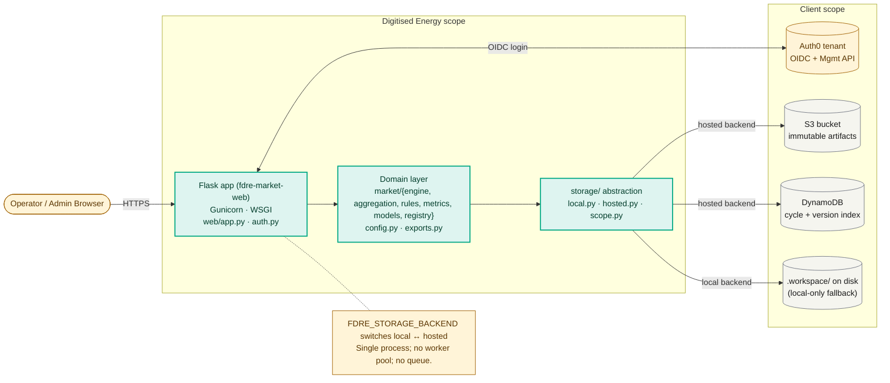
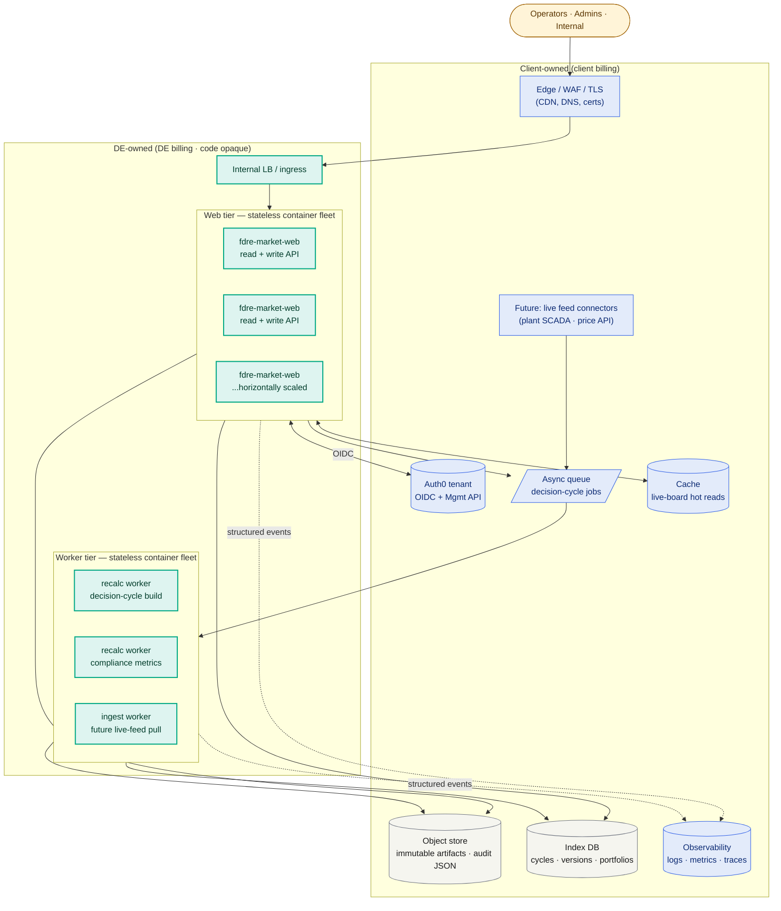
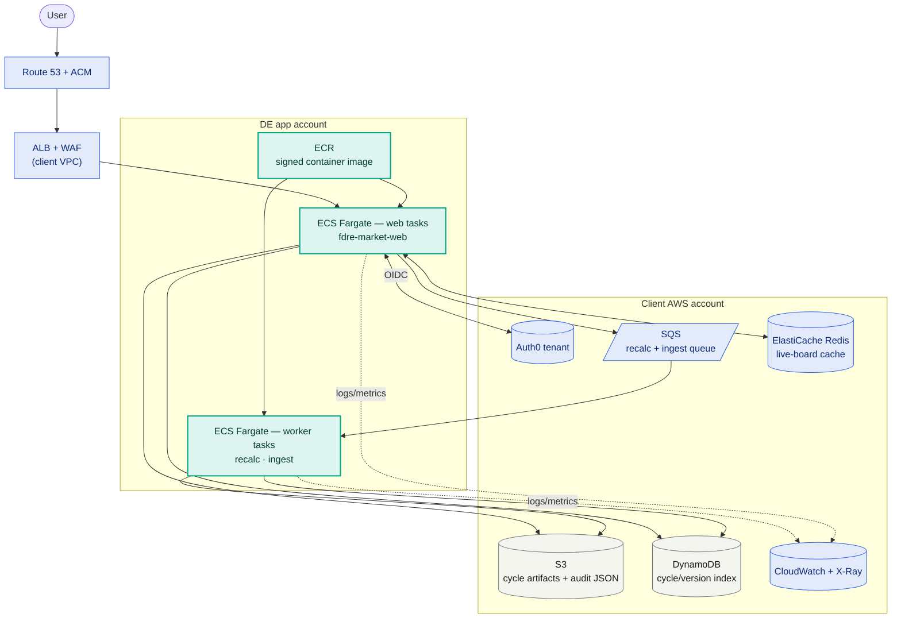
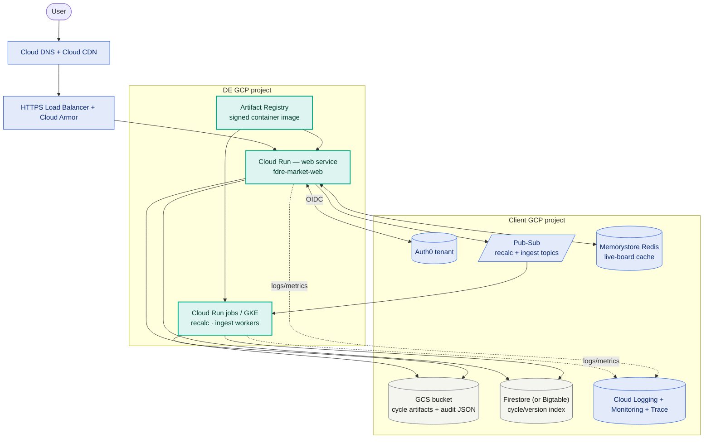
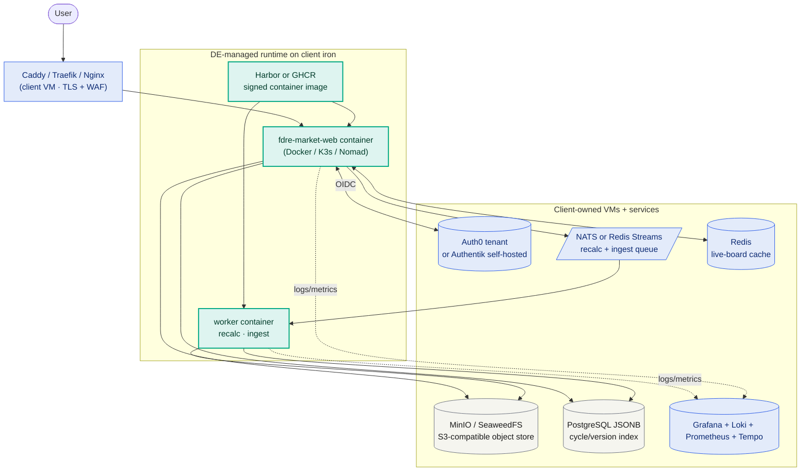
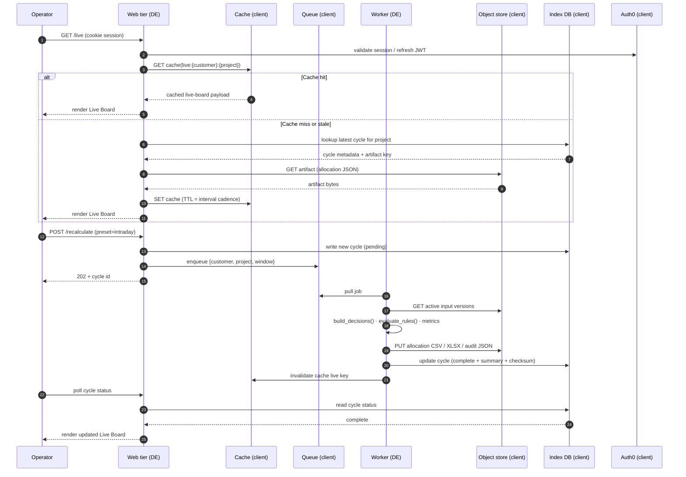

# FDRE Operations — Architecture Review

Audience: staff engineering review. Covers what's deployed today, the proposed at-scale shape, and three deployment variants (AWS / GCP / self-hosted) that all keep client infra in client scope and our code opaque.

## Scope split (commercial)

| Concern | Owner | Notes |
|---|---|---|
| **Application code** | **Digitised Energy** | Ships only as an opaque container image. Source never leaves DE control. |
| **Application servers** | **Digitised Energy** | Only cost item DE absorbs — runs the closed container. Sized per tenant. |
| Object storage (S3 / GCS / MinIO) | Client | Holds immutable cycle artifacts, raw inputs, audit JSON. |
| Index / metadata store (DynamoDB / Firestore / Postgres) | Client | Lookup table for cycles, versions, portfolios. |
| Identity provider (Auth0 tenant) | Client | OIDC; client manages users + Management API credentials. |
| Edge / CDN / WAF / TLS | Client | DNS + cert ownership stays client-side. |
| Observability (logs, metrics, traces) | Client | App emits structured events; client routes to their observability stack. |
| Backup, DR, retention policy | Client | Client controls retention rules on their bucket / table. |

DE delivers: a versioned container image, the bootstrap config it expects, and the operational runbook. Everything storage-side is client-credentialed via IAM/SA/service-key, mounted into the container at start.

---

## D1 — Current architecture (today)

Single-tenant deployment as it runs today.

**What this gives us:** functional end-to-end advisory for a single client/workspace, with full audit. **What it doesn't:** horizontal scale, async recalc, fan-out across many projects, or live-feed ingestion concurrency.

---

## D2 — Proposed at-scale logical architecture

Cloud-neutral. Drawn so the same shape fits AWS / GCP / Hetzner with different concrete services. Note the scope split — DE owns only the app servers; everything stateful or networking is client-owned and client-billed.

**Key scale moves vs today:**

| Capability | Today | At scale |
|---|---|---|
| Decision recalc | Inline on HTTP request | Enqueued; worker pool consumes |
| Live-board reads | Re-read storage per poll | Cache-backed (TTL = interval cadence) |
| Live feeds | Manual CSV/paste | Connector workers pull on schedule |
| Multi-tenant isolation | Workspace prefix in keys | Per-tenant queue + key prefix + cache namespace |
| Identity | Single Auth0 tenant | Per-client Auth0 tenant or organization |
| Scale unit | Single process | Independent web + worker autoscaling |
| Code distribution | Source-installed locally | Signed container image only |

---

## D3 — Deployment variant A · AWS

Same logical shape, mapped to managed AWS services. DE app servers run as ECS/Fargate tasks; everything else is in the client AWS account with cross-account IAM trust.

**Trust model:** ECS task role in DE account assumes a client-side IAM role with `s3:*` and `dynamodb:*` scoped to the per-customer key prefix. No client credentials in DE's account; rotation handled by AWS STS.

---

## D4 — Deployment variant B · GCP

Same shape on GCP. Cloud Run replaces Fargate; GCS, Firestore (or Bigtable), Pub/Sub, Memorystore replace the AWS storage and queue tier.

**Trust model:** DE service account is granted client-side IAM roles (`roles/storage.objectAdmin`, `roles/datastore.user`) scoped to the per-customer document path / object prefix via conditional bindings. Workload identity federation removes the need for static keys.

---

## D5 — Deployment variant C · Self-hosted (Hetzner / Contabo / OVH / on-prem)

For clients that won't go to public cloud. Same logical shape, runs on plain Linux VMs they own. DE only ships the container image; client provides everything else.

**Trust model:** Client mounts service credentials (MinIO access key, PG connection string) as Docker secrets / systemd-creds. Image only knows the configured endpoints; it never sees the client's other infrastructure.

**Why call this out:** clients in regulated geographies (e.g., India RBI / EU data-residency) often prefer Hetzner / Contabo / on-prem. The storage adapter already supports S3-compatible endpoints, so MinIO is a drop-in.

---

## D6 — Decision-cycle sequence (proposed at-scale)

End-to-end path of a single recalc, illustrating where the queue and worker fit.

---

## Open questions for review

1. **Tenancy granularity.** Today: one process per workspace via env scoping. Proposal: per-tenant queue/cache namespace + shared web fleet. Acceptable, or do we want per-tenant fleets (and pay the cold-start cost)?
2. **Code opacity at the connector layer.** Future live-feed connectors may need client-specific drivers (SCADA, OEM API). Do those ship inside the DE container, or as a thin client-side adapter that publishes to the queue?
3. **Storage adapter contract.** `storage/scope.py` already abstracts local vs hosted; do we extend it to a generic OCI/GCS/MinIO driver and let `FDRE_STORAGE_BACKEND` pick at boot, or per-customer config?
4. **Identity boundary.** Single Auth0 tenant with organisations, or one tenant per client? Affects how Management API credentials are scoped.
5. **DR posture.** Each cycle is reproducible from inputs + rule versions. Do we still mandate point-in-time backups of the index DB, or rely on the audit JSON in object store as the source of truth?
6. **Observability.** App emits structured events; what's the canonical schema the client routes to their stack (OTLP? plain JSON to stdout? StatsD)?

---

*Source for every diagram above lives in this file (`docs/architecture.md`). Rendered PNG copies are in [`docs/architecture-images/`](architecture-images/).*
